# PI2023.2

NOME DO PROJETO:
"PetMatch"

DESCRIÇÃO:
O "PetMatch" tem como objetivo localizar pets de acordo com as características do pet perdido que foram descritas no app.

FUNCIONALIDADES:
As informações sobre os pets poderão ser inseridas após a criação do cadastro do usuário. A partir do seu perfil de usuário será possível localizar os cadastros de
animais perdidos ou encontrados.
O site contará com um painel de fotos dos pets recentemente encontrados para facilitar a busca dos donos, além de um localização do local aonde o pet foi visto a ultima vez!
COMO OS USUÁRIOS PODERÃO UTILIZÁ-LO:
Os usuários poderão cadastrar os pets que encontraram ou que estão procurando e utilizar a galeria de fotos para facilitar as buscas.

AUTORES DO PROJETO:
Breno Bastos da Silva,
Camila Carvalho,
Denis Lima da Silva,
Lorena Mafra Nascimento,
Michael Amaral dos Santos.

Imagens do Projeto v2:
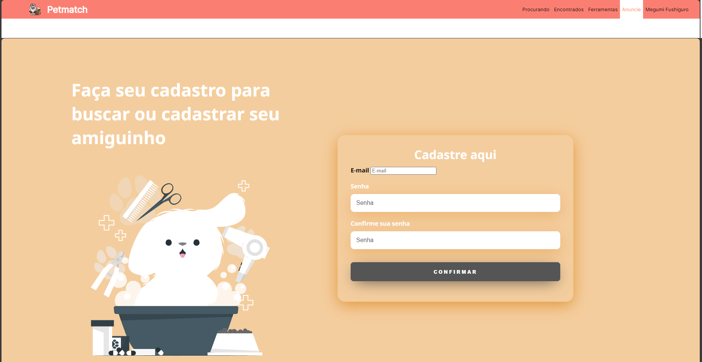
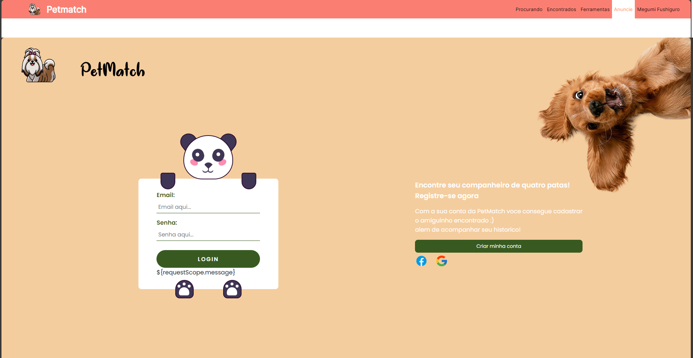
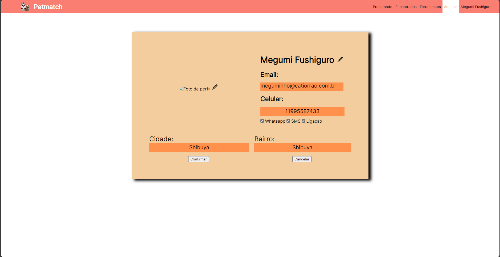

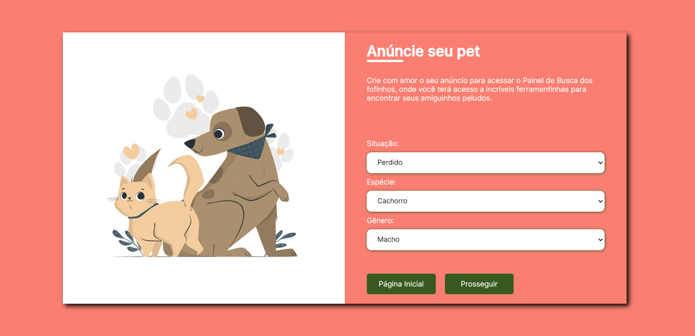
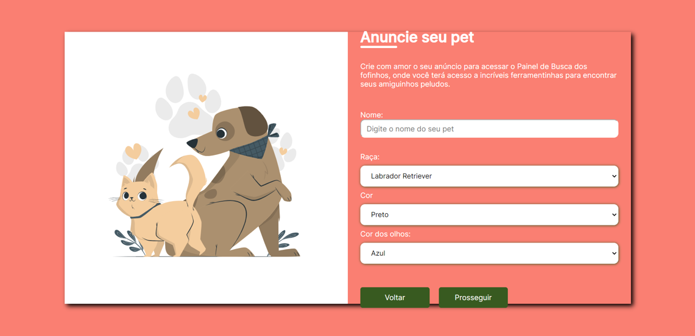
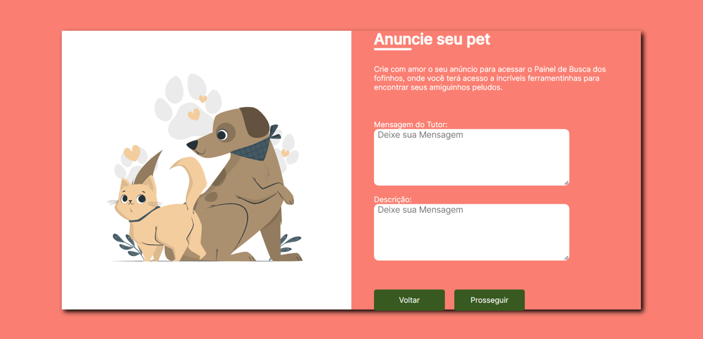
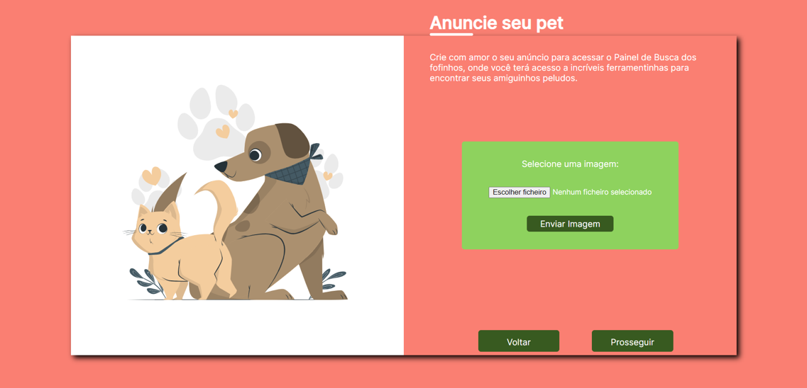
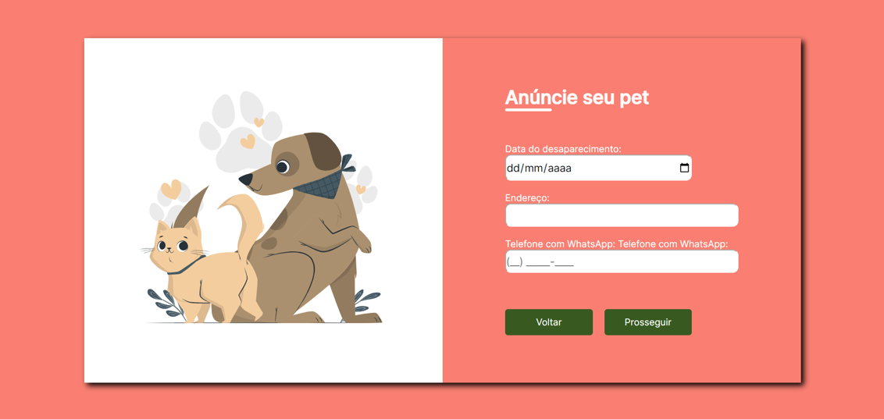
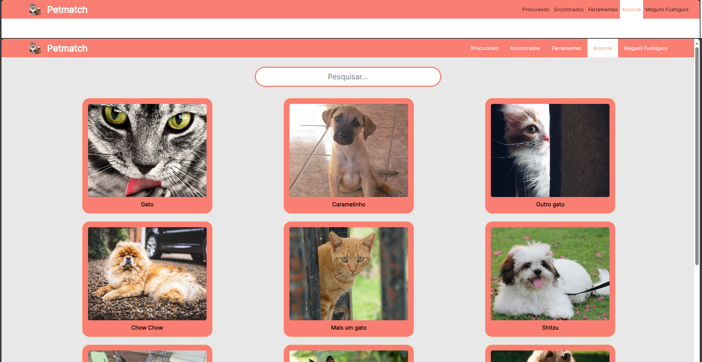
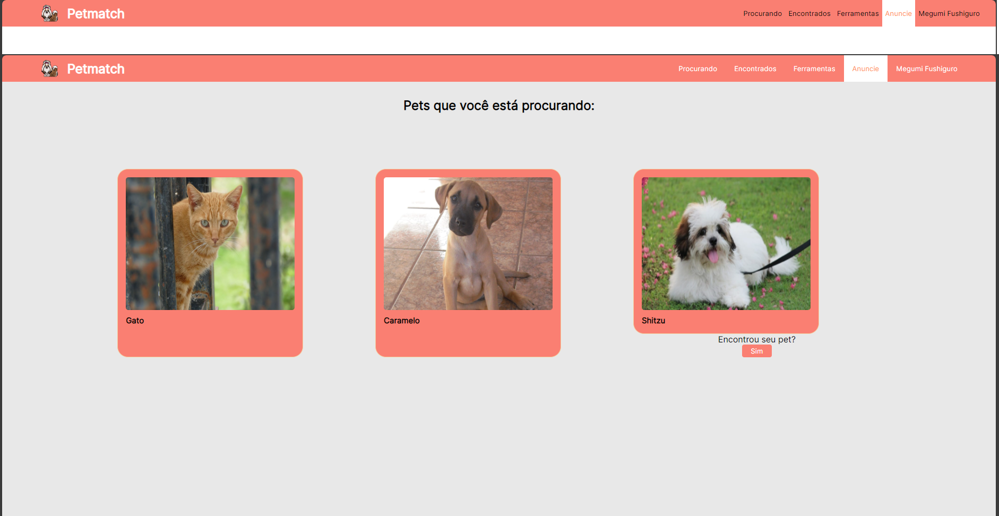
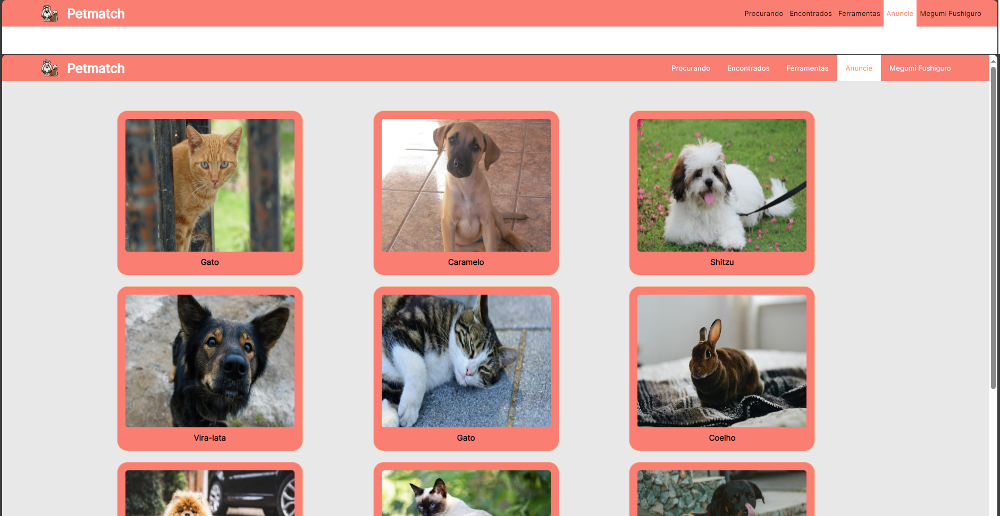

Imagens do Projeto v1:

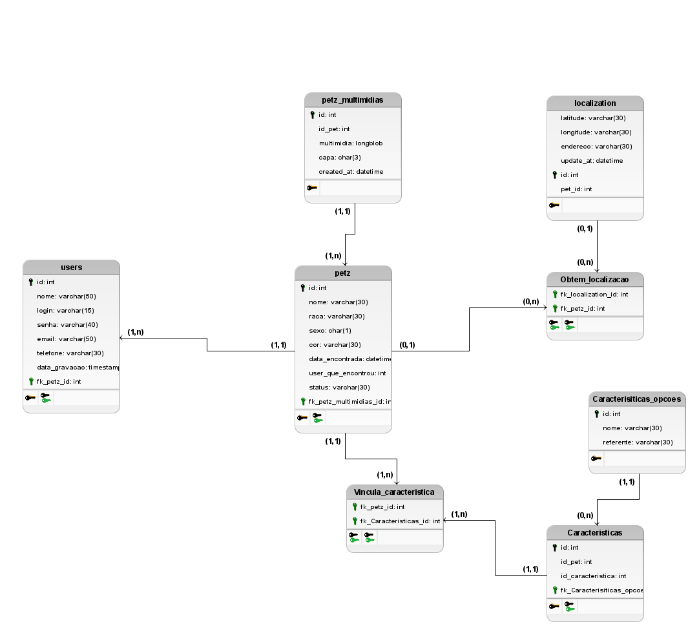

INSIRA NO H2 OS SEGUINTES COMANDOS SQL:

CREATE TABLE USR(
    ID INT PRIMARY KEY AUTO_INCREMENT,
    EMAIL VARCHAR(255),
    PASSWORD VARCHAR(255),
    TELEFONE VARCHAR(255),
    LOGIN VARCHAR(255),
    BAIRRO VARCHAR(255),
    CIDADE VARCHAR(255),
    FOTO VARCHAR(255)
);

CREATE TABLE PET (
    ID INT AUTO_INCREMENT PRIMARY KEY,
    SITUACAO VARCHAR(100),
    ESPECIE VARCHAR(100),
    GENERO VARCHAR(100),
    NOME VARCHAR(100),
    RACA VARCHAR(100), 
    COR VARCHAR(100),
    CORDOSOLHOS VARCHAR(100),
    MENSAGEM VARCHAR(512),
    DESCRICAO VARCHAR(512),
    IMAGE VARCHAR(255),
    DATA_DESAPARECIMENTO DATETIME,
    ENDERECO VARCHAR(100),
    WHATSAPP VARCHAR(20),
    USER_ID INT
); 

CREATE TABLE PetLocation (
    petId INT,
    longitude DECIMAL(10, 6),
    latitude DECIMAL(10, 6),
    FOREIGN KEY (petId) REFERENCES Pet(id)
);

