# PI2023.2

NOME DO PROJETO:
"PetMatch"

DESCRIÇÃO:
O "PetMatch" tem como objetivo localizar pets de acordo a foto postada no site, junto com outras informações do pet, como suas características e último local onde foi visto.

FUNCIONALIDADES:
As informações sobre os pets poderão ser inseridas após a criação do cadastro do usuário, e a busca pelos pets perdidos e que estão procurando por um tutor pode ser feita dentro e fora da área logada, que por sua vez, pode ser editada pelo usuário, com foto de perfil e telefone para contato.
O site contará com um painel de fotos dos pets procurados para que o usuário possa acessar o perfil do pet e visualizar a um mapa com sua última localização, e contatar o seu tutor por meio do telefone disponível. 
Na tela "Meus Pets", o usuário pode marcá-los como encontrados caso a busca tenha sido bem sucedida, excluindo o botão de "Encontrou seu Pet?" e deixando uma mensagem de "Encontrado" marcando a foto.

COMO OS USUÁRIOS PODERÃO UTILIZÁ-LO:
Os usuários poderão cadastrar os pets que encontraram ou que estão procurando e utilizar a galeria de fotos para facilitar as buscas, além de utilizar o perfil do pet para visualizar sua última localização e o contato de seu tutor.

AUTORES DO PROJETO:
Breno Bastos da Silva,
Camila Carvalho,
Denis Lima da Silva,
Lorena Mafra Nascimento,
Michael Amaral dos Santos.

Imagens do Projeto:
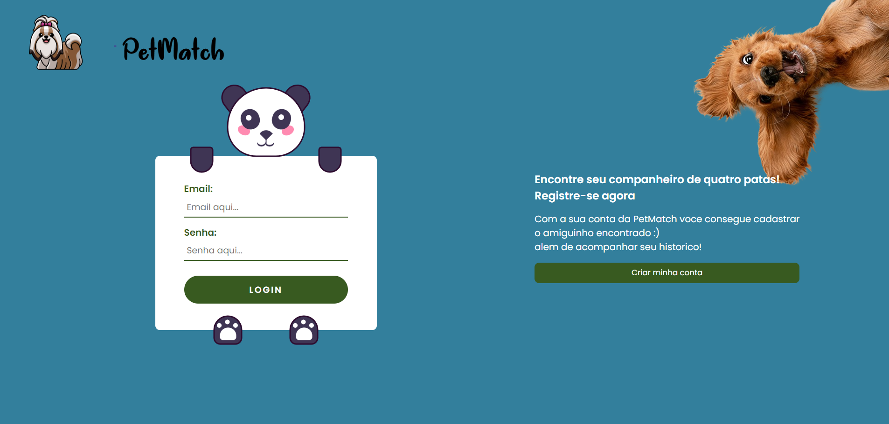
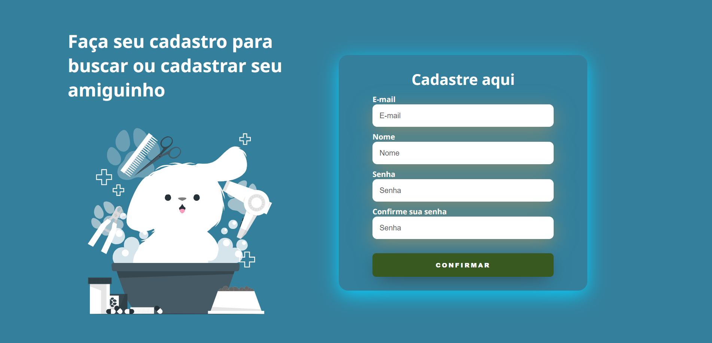
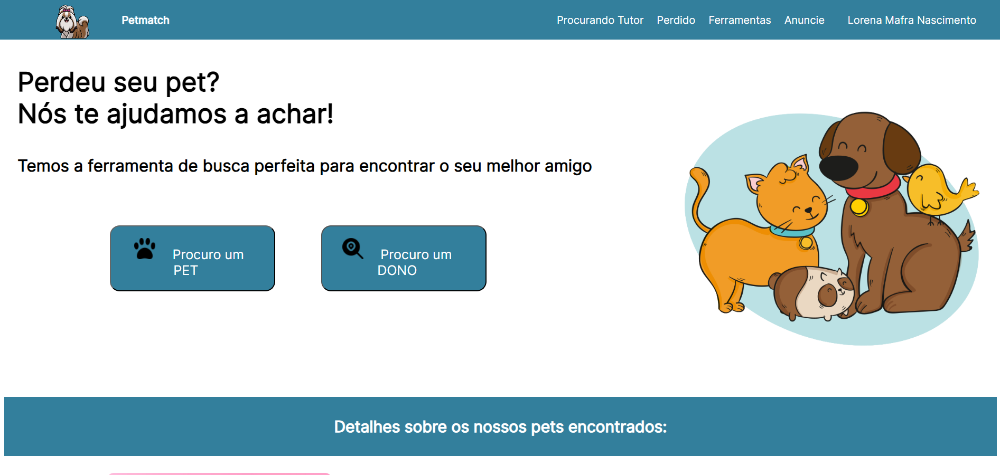
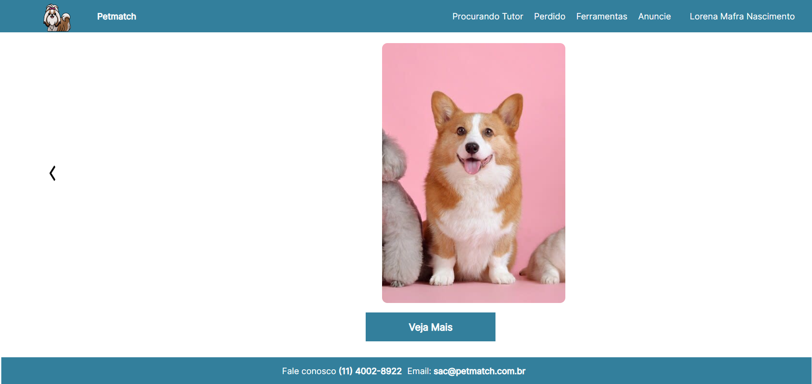
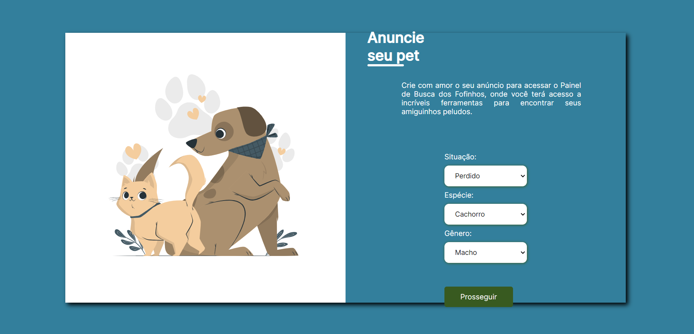
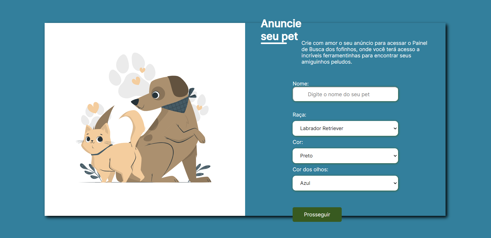
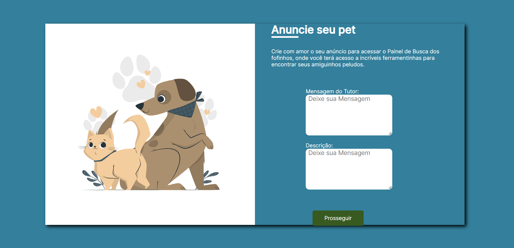
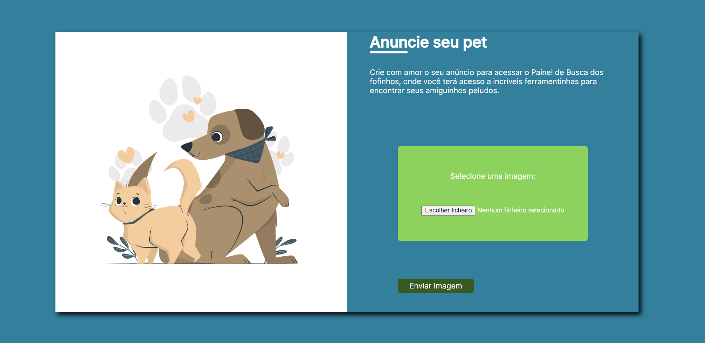
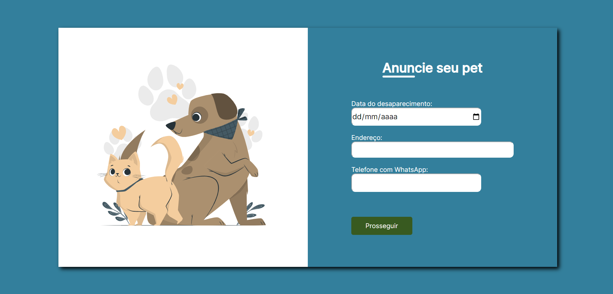
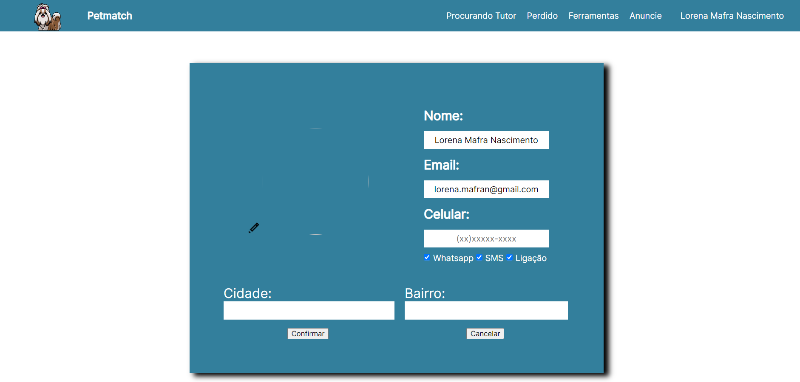
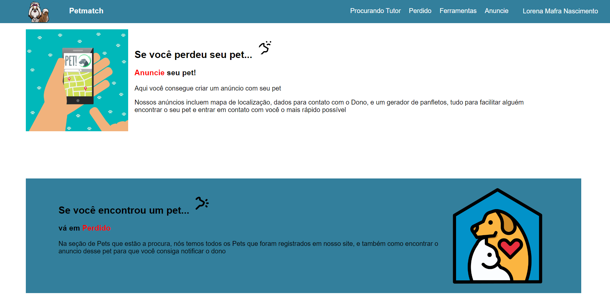
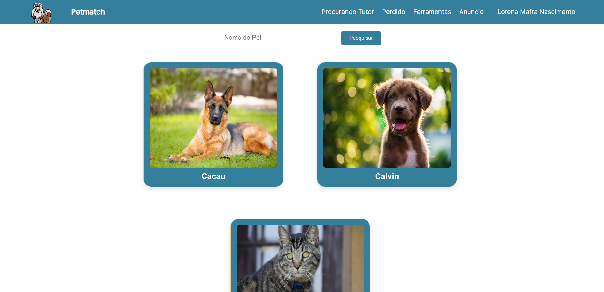
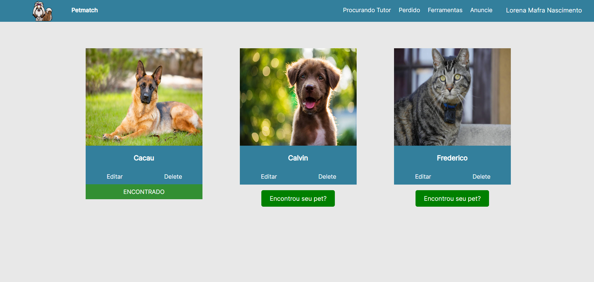
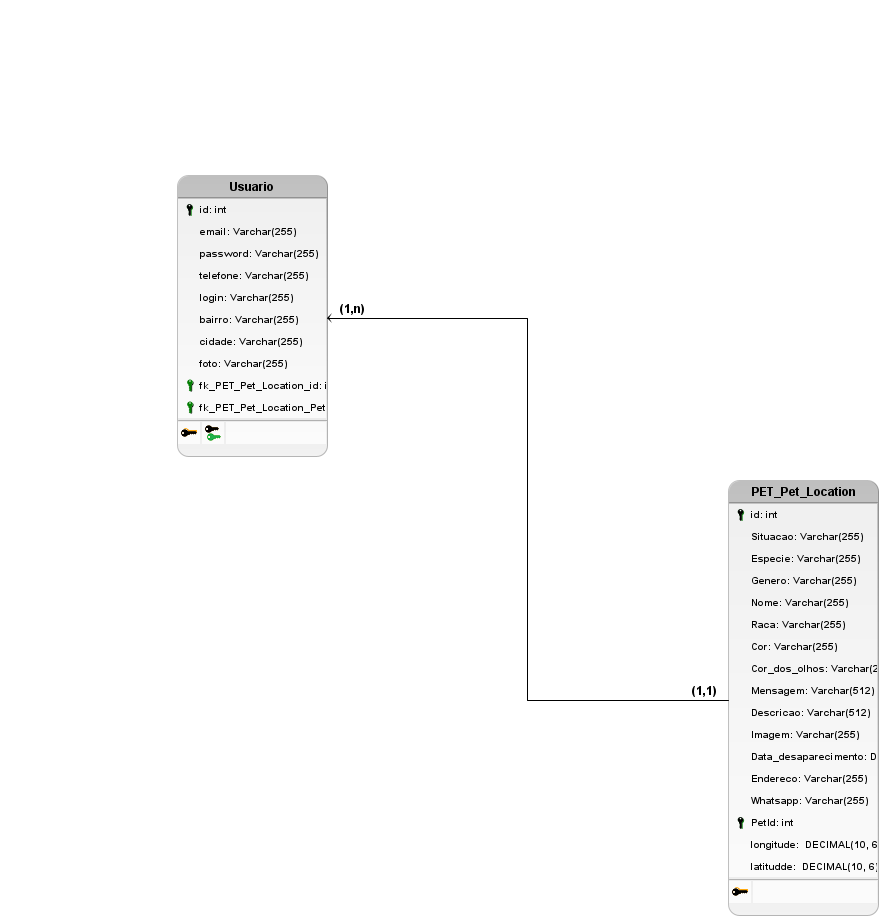

INSIRA NO H2 OS SEGUINTES COMANDOS SQL:

CREATE TABLE USR( ID INT PRIMARY KEY AUTO_INCREMENT, EMAIL VARCHAR(255), PASSWORD VARCHAR(255), TELEFONE VARCHAR(255), LOGIN VARCHAR(255), BAIRRO VARCHAR(255), CIDADE VARCHAR(255), FOTO VARCHAR(255) );

CREATE TABLE PET ( ID INT AUTO_INCREMENT PRIMARY KEY, SITUACAO VARCHAR(100), ESPECIE VARCHAR(100), GENERO VARCHAR(100), NOME VARCHAR(100), RACA VARCHAR(100), COR VARCHAR(100), CORDOSOLHOS VARCHAR(100), MENSAGEM VARCHAR(512), DESCRICAO VARCHAR(512), IMAGE VARCHAR(255), DATA_DESAPARECIMENTO DATETIME, ENDERECO VARCHAR(100), WHATSAPP VARCHAR(20), USER_ID INT );

CREATE TABLE PetLocation ( petId INT, longitude DECIMAL(10, 6), latitude DECIMAL(10, 6), FOREIGN KEY (petId) REFERENCES Pet(id) );
